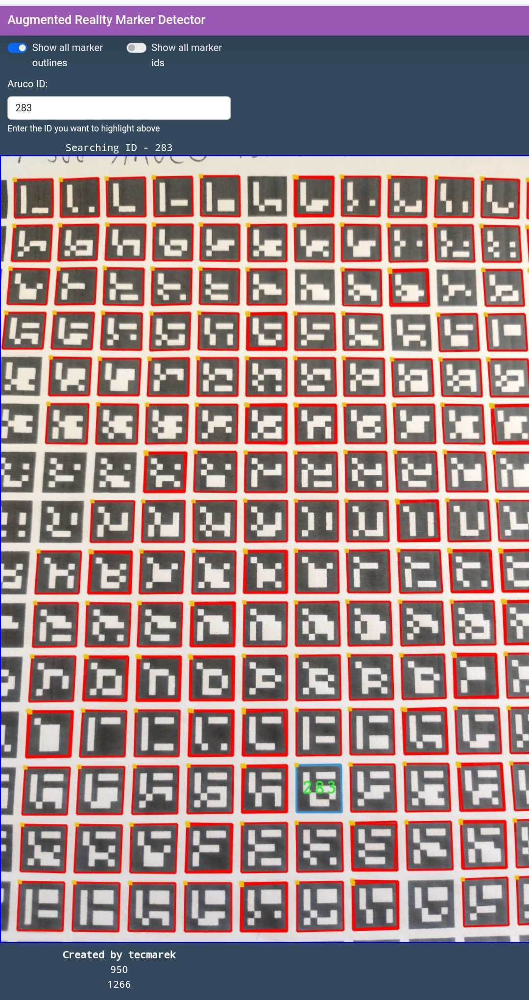
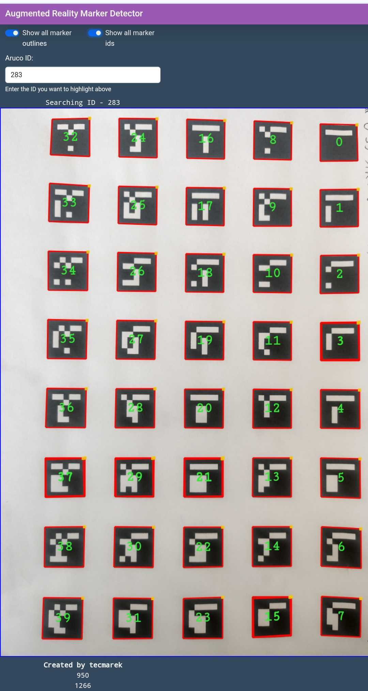
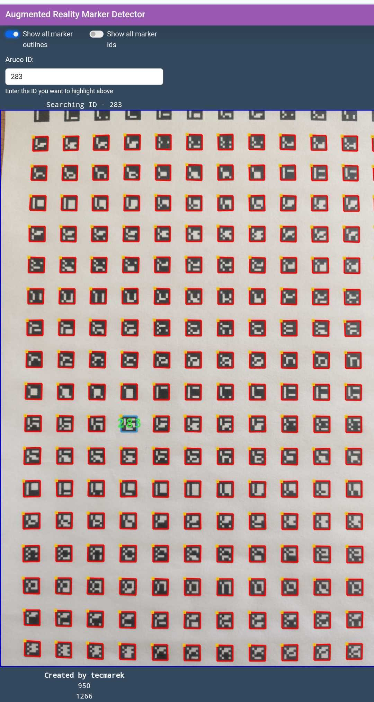
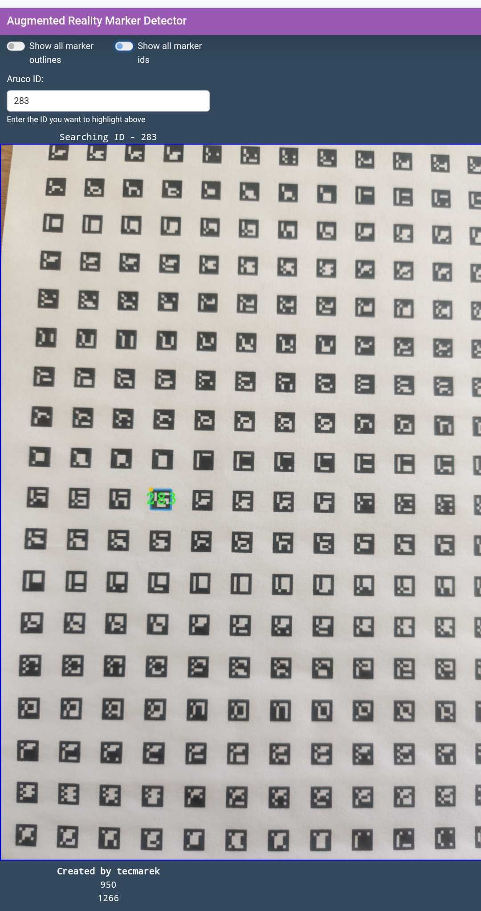

# aruco-inventory
Simple proof of concept for using aruco/apriltag markers to quickly find an inventory position based on its marker ID.
Runs locally in the devices browser. Therefor the performance varies drastically based on the used device!
The time the detector needs for each frame is shown on the bottom of the page.

[Demo](https://tecmarek.github.io/aruco-inventory/) (Works best with Chrome or Firefox)

## Used tags
This demo currently only supports the AprilTag tagStandard52h13 tags.
This set of tags supports up to 48714 IDs, which should be enough for even larger inventories.
A online generator can be found here: [April Tags generator](https://chaitanyantr.github.io/apriltag.html)

In the layouts folder there are also three pdfs (DIN A4) with test grids of tags in different sizes.

## Based on
This demo is based on the [apriltag-js-standalone](https://github.com/arenaxr/apriltag-js-standalone) project.
With which the apriltag_wasm.js and apriltag_wasm.wasm files were compiled. For this to support the tagStandard52h13 tags the following steps have to be taken:

- The project default of tag36h11 has to be replaced in the apriltag-js-standalone/src/apriltag_js.c file (Include .h, x_create(), x_destroy()).

- In the apriltag-js-standalone/Makefile the tagStandard52h13.c file has to be included in the APRILTAG_SRCS definition by removing the corresponding -e term.

# Using the Python listings
To use the included python listings, you need a Python installation with tkinter support, for example `apt install python3-tk`.

After that, follow these steps:

1. Create a virtual environment `python3 -m venv venv`
2. Activate the environment `source venv/bin/activate`
3. Install the requirements from requirements.txt `pip install -r requirements.txt`

## Layout generator
The layout generator can be used to create custom layouts (grids) of apriltags like the ones provided in the layouts folder. To customize the generation change the values under "Generator settings" in the listing and run it.

    python layout_generator.py

# Generating needed ssl key pair
Run the following command in the src folder:

    openssl req -newkey rsa:2048 -nodes -keyout client-key.pem -x509 -days 3650 -out client-cert.crt

This is a self signed certificate which your browser does not accept by default. You can either add it to your browser or simply accept the warning your browser is giving you.

# Running the server
In the src folder to install run:

    npm install

and to start the server

    npm run start

you can then open the server locally under https://127.0.0.1:4433/ or open it in your network replacing 127.0.0.1 with your PCs IP address.

# Application in use

Old images -> will be updated in the future!

Printed tags 10mm x 10mm in size (option showing all outlines enabled):

Printed tags 20x20mm in size (options showing all outlines and IDs enabled):

Printed tags 5mm x 5mm in size (option showing all outlines enabled):

Printed tags 5mm x 5mm in size:

